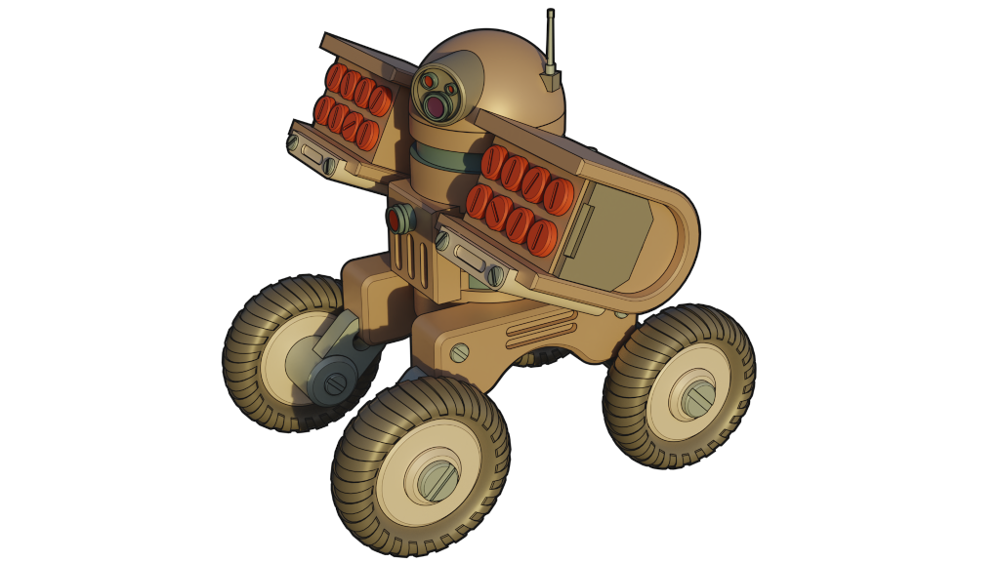

# Awesome 3D Web 

> A curated list of amazingly awesome articles, applications, software libraries and projects related to the 3D web space. This subject is of particular interest to me within the context of several personal projects that I am working on including an interactive e-book prototype ([Codex Roboticus](https://brettkromkamp.com/posts/codex-roboticus/)) and a knowledge management application ([Contextualise](https://github.com/brettkromkamp/contextualise)).

## Contents

- [Frameworks](#frameworks)
- [Libraries](#libraries)
- [Applications](#applications)
- [Tools](#tools)
- [Articles](#articles)
- [Miscellaneous](#miscellaneous)

## Frameworks

- [three.js](https://threejs.org/) - Three.js is a cross-browser JavaScript library and API used to create and display 3D computer graphics in a web browser using WebGL.
- [babylon.js](https://www.babylonjs.com/) - Babylon.js is a real-time 3D engine using a JavaScript library for displaying 3D graphics in a web browser using WebGL.

## Libraries

- [3D Force-Directed Graph](https://github.com/vasturiano/3d-force-graph) - A web component to represent a graph data structure in a 3-dimensional space using a force-directed iterative layout.

## Applications

- [Blender](https://www.blender.org/) - Blender is a free and open source 3D creation suite.

## Tools

- [glTF Viewer](https://gltf-viewer.donmccurdy.com/) - A drag-and-drop previewer for glTF 2.0 models in WebGL using three.js.

## Articles

- [Visualizing Graphs in 3D with WebGL](https://medium.com/neo4j/visualizing-graphs-in-3d-with-webgl-9adaaff6fe43)

## Miscellaneous

- [glTF Runtime 3D Asset Deliver](https://www.khronos.org/gltf/) - As a royalty-free specification for the efficient transmission and loading of 3D scenes and models by applications.
